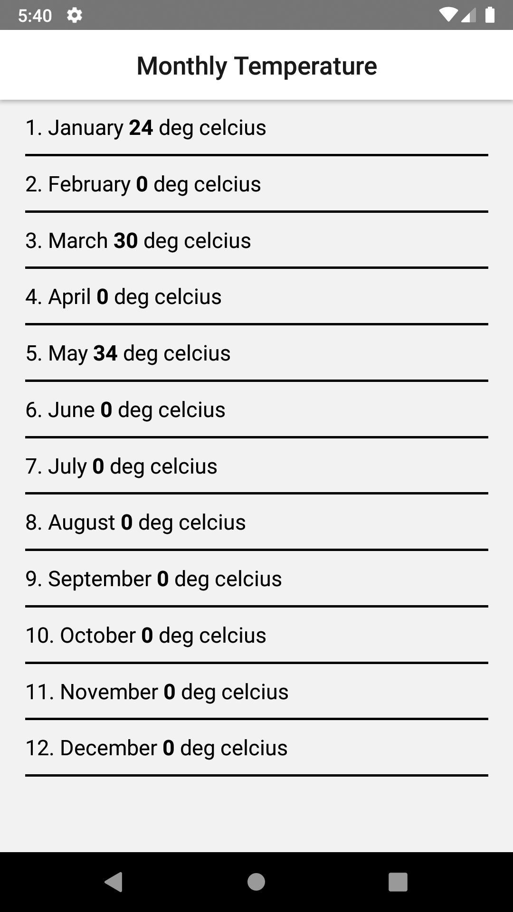

# Navigation Pages

# Installation

The app is fully developed with the react-native-cli.

In order to install the app in your emulator or in simulator, clone the project, go to the root directory of the project and run npm install. After installing npm packages run react-native run-android for ANDROID and react-native run-ios for IOS.

 ### App Screens (Android Screenshots - Emulator)

    
    
    

